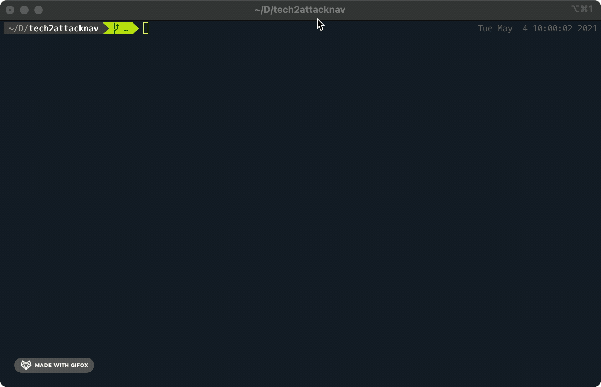
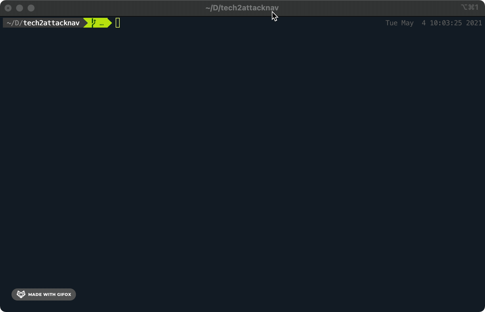

# Tech2AttackNav
## About The Project
A Python CLI utility for quickly converting a list or text file of MITRE ATT&CK parent technique IDs to a MITRE ATT&CK Navigator layer .JSON file.

- Free software: MIT license
## Getting Started
### Installation
#### Option A: Git
Clone the repository using Git:
```git clone https://github.com/infosecB/tech2attacknav.git```

#### Option B: Download .zip
Download the repository using the Github web UI:
https://github.com/infosecB/tech2attacknav/archive/refs/heads/main.zip

### Usage
```
python tech2attacknav.py -i input_file.txt -n ActorName
```
## Example

[FireEye UNC2630 Report](https://www.fireeye.com/blog/threat-research/2021/04/suspected-apt-actors-leverage-bypass-techniques-pulse-secure-zero-day.html): FireEye provides a detailed report of techniques associated with this particular actor and even includes a screenshot of a MITRE ATT&CK navigator layer. What if you would like to use the ATT&CK navigator layer to map existing visibility and detection content to understand where your weaknesses may exist? Tech2AttackNav to the rescue! Copy and paste the list of technique IDs into a text file and let the script do its work.

1. Select & copy list of technique IDs


2. Paste into ttps.txt file in same directory as the script



3. Run script: ```python tech2attacknav.py -i ttps.txt -n UNC2630```



4. Open MITRE's [ATT&CK Navigator](https://mitre-attack.github.io/attack-navigator/)
5. Upload existing layer button
6. Select the result.json file in the same directory as the script


## Roadmap

- Add ability to parse subtechnique IDs
- Add webscraping functionality
